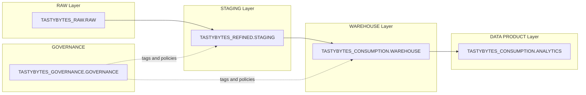

# Plan: Generate Training Exercise Assets

## Context

The design-brief.md fully specifies the exercise: 4 learner-built tables across 3 layers (STAGING, WAREHOUSE, DATA PRODUCT), with governance (tags, masking), RBAC (3 roles), orchestration (task graphs), and a reporting view. All design decisions are resolved. This plan covers generating the 5 deliverables requested, organized into 10 files.

## File Structure

```
snowflake-de-exercsiev2/
  brief.md                          (existing)
  design-brief.md                   (existing)
  exercises/
    00_background.md                (deliverable 1)
    01_module1_raw_to_staging.md    (deliverable 2)
    02_module2_staging_to_warehouse.md  (deliverable 2)
    03_module3_warehouse_to_product.md  (deliverable 2)
  model_answer/
    model_answer.md                 (deliverable 3 - overview)
    module1_staging.sql             (deliverable 3 - SQL)
    module2_warehouse.sql           (deliverable 3 - SQL)
    module3_data_product.sql        (deliverable 3 - SQL)
  scripts/
    validate_exercise.sql           (deliverable 4)
    validate_exercise_instructions.md
    test_incremental_load.sql       (deliverable 5)
    test_incremental_load_instructions.md
```

---

## Implementation Steps

### Task 1: Learner Background Context (`exercises/00_background.md`)

A single markdown file containing four sections:

**1.1 Purpose and Objectives** — Restate from design brief section 2: build an end-to-end pipeline, learn DDL design, stored procedures, task graphs, governance, and catalog documentation.

**1.2 Business Scenario** — Expand design brief section 4 into a narrative: TastyBytes is a food truck company operating across multiple cities. The analytics team needs a monthly dashboard showing sales volume, revenue, and margin by menu item, category, and location. Define the key business terms (revenue, COGS, margin, margin %).

**1.3 Architecture Overview** — Include two mermaid diagrams:

Data architecture (layers and schemas):



RBAC model showing the 3 roles and their access to each layer.

**1.4 What You Will Build** — A mermaid diagram showing the specific objects learners create (4 staging tables, 2 dimensions, 1 fact, 1 view) and how they connect, with pre-populated objects shown differently. Plus a summary table of the 3 modules.

---

### Task 2: Module 1 Instructions (`exercises/01_module1_raw_to_staging.md`)

Structured as numbered tasks, each with:

- Objective (what to build)
- Requirements (columns, types, naming conventions, standards)
- Hints (Snowflake syntax references where relevant for the target audience)
- Validation query to run after completing the task

**Tasks in this module:**

| Task | Title                               | Key Content                                                                                                                                                                                                                   |
| ---- | ----------------------------------- | ----------------------------------------------------------------------------------------------------------------------------------------------------------------------------------------------------------------------------- |
| 1.1  | Explore RAW tables                  | Instructions to run DESCRIBE/SELECT on MENU, ORDER\_HEADER, ORDER\_DETAIL, CUSTOMER\_LOYALTY. Identify data quality issues.                                                                                                   |
| 1.2  | Create STG\_MENU table              | DDL requirements: all MENU columns + flattened JSON fields (4 boolean flags + ingredients) + 3 metadata columns. Naming convention: STG\_ prefix.                                                                             |
| 1.3  | Create STG\_ORDER\_HEADER table     | DDL requirements: fix LOCATION\_ID to NUMBER, SERVED\_TS to TIMESTAMP\_NTZ, ORDER\_TAX\_AMOUNT and ORDER\_DISCOUNT\_AMOUNT to NUMBER. Add metadata columns.                                                                   |
| 1.4  | Create STG\_ORDER\_DETAIL table     | DDL requirements: fix ORDER\_ITEM\_DISCOUNT\_AMOUNT to NUMBER. Add metadata columns.                                                                                                                                          |
| 1.5  | Create STG\_CUSTOMER\_LOYALTY table | DDL requirements: fix CHILDREN\_COUNT to NUMBER. Add metadata columns.                                                                                                                                                        |
| 1.6  | Apply governance tags and comments  | Apply DATA\_DOMAIN, DATA\_CLASSIFICATION, COST\_CENTER tags to all 4 tables. Apply TASTY\_PII tags to 5 PII columns on STG\_CUSTOMER\_LOYALTY. Add table and column COMMENTs. Provide the exact tag names and allowed values. |
| 1.7  | Define GRANTS                       | Grant appropriate privileges to TB\_DATA\_ENGINEER on all staging objects.                                                                                                                                                    |
| 1.8  | Create load procedures              | One stored procedure per staging table using TRUNCATE-reload pattern. Specify LANGUAGE SQL, EXECUTE AS CALLER. Provide the pattern template.                                                                                  |
| 1.9  | Create task graph                   | Root task + 4 child tasks with dependency diagram. Instructions on RESUME/EXECUTE.                                                                                                                                            |
| 1.10 | Execute and validate                | Run the task graph. Validation queries: row counts, NULL checks, data type verification, masking test (switch to TB\_ANALYST role).                                                                                           |

**Standards section at top of file:**

- Naming: STG\_ prefix, uppercase, underscores
- Metadata columns: \_LOAD\_TS, \_SOURCE\_TABLE, \_LOAD\_ID
- All VARCHAR columns: TRIM whitespace
- NULLs: preserve (do not COALESCE unless specified)
- Warehouse: USE WAREHOUSE TB\_DE\_WH
- Role: USE ROLE TB\_DATA\_ENGINEER (except governance tasks which use TB\_ADMIN)

---

### Task 3: Module 2 Instructions (`exercises/02_module2_staging_to_warehouse.md`)

**Tasks in this module:**

| Task | Title                                            | Key Content                                                                                                                                                                                                                                                                 |
| ---- | ------------------------------------------------ | --------------------------------------------------------------------------------------------------------------------------------------------------------------------------------------------------------------------------------------------------------------------------- |
| 2.1  | Create DIM\_MENU table (SCD Type 2)              | DDL: surrogate key (AUTOINCREMENT), natural key (MENU\_ITEM\_ID), all business columns, VALID\_FROM, VALID\_TO, IS\_CURRENT, metadata columns. Explain SCD2 concept briefly.                                                                                                |
| 2.2  | Create DIM\_CUSTOMER table (SCD Type 1)          | DDL: surrogate key, natural key (CUSTOMER\_ID), business columns, IS\_DELETED flag, metadata columns.                                                                                                                                                                       |
| 2.3  | Create FACT\_ORDER\_LINE table                   | DDL: surrogate keys to DIM\_MENU, DIM\_CUSTOMER, DIM\_LOCATION, DIM\_DATE. Degenerate dimensions (ORDER\_ID, ORDER\_DETAIL\_ID). Measures: QUANTITY, UNIT\_PRICE, LINE\_PRICE, COGS\_AMOUNT, DISCOUNT\_AMOUNT. Metadata columns.                                            |
| 2.4  | Apply governance tags and comments               | Same pattern as Module 1. PII tags on DIM\_CUSTOMER.                                                                                                                                                                                                                        |
| 2.5  | Define GRANTS                                    | TB\_DATA\_ENGINEER ownership, TB\_ANALYST SELECT on warehouse tables.                                                                                                                                                                                                       |
| 2.6  | Create DIM\_MENU load procedure (SCD2 MERGE)     | Detailed requirements for the MERGE: match on MENU\_ITEM\_ID + IS\_CURRENT, detect changes in tracked columns (SALE\_PRICE\_USD, COST\_OF\_GOODS\_USD, MENU\_ITEM\_NAME, ITEM\_CATEGORY, ITEM\_SUBCATEGORY), close old record + insert new. Provide MERGE pattern template. |
| 2.7  | Create DIM\_CUSTOMER load procedure (SCD1 MERGE) | MERGE on CUSTOMER\_ID. UPDATE changed columns, INSERT new, set IS\_DELETED for removed.                                                                                                                                                                                     |
| 2.8  | Create FACT\_ORDER\_LINE load procedure          | MERGE on ORDER\_DETAIL\_ID. Lookup surrogate keys from all dimensions. Calculate COGS\_AMOUNT (DIM\_MENU.COST\_OF\_GOODS\_USD \* QUANTITY).                                                                                                                                 |
| 2.9  | Create task graph                                | Warehouse task graph with DIM\_MENU and DIM\_CUSTOMER parallel, FACT\_ORDER\_LINE dependent on both.                                                                                                                                                                        |
| 2.10 | Execute and validate                             | Row counts, IS\_CURRENT checks for DIM\_MENU, NULL surrogate key checks on fact table.                                                                                                                                                                                      |

**Standards section:**

- Naming: DIM\_ prefix for dimensions, FACT\_ prefix for facts
- Surrogate keys: column named {TABLE}\_SK, AUTOINCREMENT
- Metadata: \_DW\_LOAD\_TS, \_DW\_UPDATE\_TS
- SCD2 additional: VALID\_FROM, VALID\_TO, IS\_CURRENT

---

### Task 4: Module 3 Instructions (`exercises/03_module3_warehouse_to_product.md`)

**Tasks in this module:**

| Task | Title                                 | Key Content                                                                                                                                                                                                                                              |
| ---- | ------------------------------------- | -------------------------------------------------------------------------------------------------------------------------------------------------------------------------------------------------------------------------------------------------------- |
| 3.1  | Create RPT\_MONTHLY\_MENU\_SALES view | Full column specification from design brief section 8. JOIN pattern: FACT\_ORDER\_LINE to DIM\_MENU (on DIM\_MENU\_SK, WHERE IS\_CURRENT = TRUE or use the SK that was looked up at fact load time), DIM\_DATE, DIM\_LOCATION. GROUP BY month/item/city. |
| 3.2  | Apply governance tags and comments    | DATA\_DOMAIN = 'Sales', DATA\_CLASSIFICATION = 'Internal'.                                                                                                                                                                                               |
| 3.3  | Define GRANTS                         | TB\_ANALYST SELECT.                                                                                                                                                                                                                                      |
| 3.4  | Validate with business queries        | 3 sample queries provided: monthly revenue trend, top 10 items by margin %, revenue by category and city.                                                                                                                                                |

---

### Task 5-7: Model Answer SQL Files

Three SQL files, one per module. Each statement preceded by a comment block:

```sql
-- =============================================================
-- Module 1, Task 1.2: Create STG_MENU staging table
-- Flattens JSON health metrics, adds metadata columns
-- =============================================================
CREATE OR REPLACE TABLE ...
```

**module1\_staging.sql** will contain \~20 statements:

- 4x CREATE TABLE (staging tables)
- 4x ALTER TABLE SET TAG (DATA\_DOMAIN, DATA\_CLASSIFICATION, COST\_CENTER per table)
- 5x ALTER TABLE ALTER COLUMN SET TAG (PII tags on STG\_CUSTOMER\_LOYALTY)
- 4x COMMENT ON TABLE + column comments
- GRANT statements
- 4x CREATE PROCEDURE (TRUNCATE-reload)
- 5x CREATE TASK (root + 4 children)
- ALTER TASK RESUME statements
- EXECUTE TASK statement

**module2\_warehouse.sql** will contain \~18 statements:

- 3x CREATE TABLE (DIM\_MENU, DIM\_CUSTOMER, FACT\_ORDER\_LINE)
- Tag and comment statements
- GRANT statements
- 3x CREATE PROCEDURE (SCD2 MERGE, SCD1 MERGE, FACT MERGE)
- 4x CREATE TASK (root + 3 children)
- ALTER TASK RESUME + EXECUTE

**module3\_data\_product.sql** will contain \~5 statements:

- 1x CREATE VIEW
- Tag and comment statements
- GRANT statements

---

### Task 8: Model Answer Overview (`model_answer/model_answer.md`)

Markdown document with:

- Overview of the model answer structure (3 SQL files)

- Design rationale for key decisions:

  - Why TRUNCATE-reload for staging (idempotent, simple, appropriate for batch)
  - Why SCD2 for DIM\_MENU (price tracking enables historical margin analysis)
  - Why AUTOINCREMENT for surrogate keys (simpler than SEQUENCE for this exercise)
  - Why MERGE for facts (handles re-runs without duplicates)
  - Why IS\_CURRENT flag lookup in the fact procedure (not in the view)
  - COGS calculation approach (lookup at fact load time, frozen at point of sale)

- References to each SQL file with summary of what it contains

- No SQL in the markdown -- all SQL lives in the .sql files

---

### Task 9: Validation Script (`scripts/validate_exercise.sql` + `scripts/validate_exercise_instructions.md`)

A single SQL script that checks all exercise requirements. Organized into sections:

**Object existence checks:**

- Verify all 4 staging tables exist (INFORMATION\_SCHEMA.TABLES)
- Verify all 3 warehouse tables exist
- Verify reporting view exists
- Verify all 7 stored procedures exist
- Verify all task objects exist

**Schema checks:**

- Verify key columns have correct data types (e.g., STG\_ORDER\_HEADER.LOCATION\_ID is NUMBER not FLOAT)
- Verify metadata columns exist on all tables
- Verify SCD2 columns exist on DIM\_MENU (VALID\_FROM, VALID\_TO, IS\_CURRENT)
- Verify surrogate key columns exist on warehouse tables

**Governance checks:**

- Verify DATA\_DOMAIN tag is set on all learner-created tables
- Verify DATA\_CLASSIFICATION tag is set
- Verify COST\_CENTER tag is set
- Verify TASTY\_PII tags on 5 PII columns of STG\_CUSTOMER\_LOYALTY
- Verify table-level COMMENTs are not empty
- Verify PII masking works (switch to TB\_ANALYST, query PII columns, check for masked values)

**Data checks:**

- Row count validations per design brief section 12
- NULL checks on surrogate keys in FACT\_ORDER\_LINE
- DIM\_MENU IS\_CURRENT = TRUE count
- Reporting view returns 12 months
- Revenue tie-back between view and STG\_ORDER\_DETAIL

**Grant checks:**

- Verify TB\_ANALYST has SELECT on warehouse tables and reporting view
- Verify TB\_ANALYST does NOT have access to staging tables

Output format: Each check returns a row with CHECK\_NAME, STATUS (PASS/FAIL), DETAIL. The script unions all checks into a single result set.

The instructions markdown file explains how to run it and interpret results.

---

### Task 10: Incremental Data Test Script (`scripts/test_incremental_load.sql` + `scripts/test_incremental_load_instructions.md`)

A SQL script that:

1. **Captures baseline** — Records current row counts and max dates in the reporting view

2. **Inserts test data into RAW** — Adds \~100 new ORDER\_HEADER rows and corresponding ORDER\_DETAIL rows for a future date (e.g., 2023-01-15) with known menu items and locations. Uses INSERT with synthetic but realistic data.

3. **Triggers the pipeline** — EXECUTE TASK on the staging root task, then the warehouse root task (with appropriate waits using SYSTEM$WAIT or TASK\_HISTORY checks)

4. **Validates propagation:**

   - New rows appear in STG\_ORDER\_HEADER and STG\_ORDER\_DETAIL
   - New rows appear in FACT\_ORDER\_LINE with correct surrogate key lookups
   - RPT\_MONTHLY\_MENU\_SALES shows data for the new month (January 2023)
   - Revenue in the view for the new month matches the inserted test data

5. **Cleanup** — Optionally removes the test data from RAW and re-runs the pipeline

The instructions markdown explains the purpose (prove the pipeline works end-to-end for incremental data), how to run each step, and what to look for in the results.

---

## Verification

After generating all assets:

1. Each SQL file should be syntax-checked by running with `only_compile=true` where possible
2. The model answer SQL should be internally consistent (table names in procedures match DDL, surrogate key names in fact match dimensions)
3. The validation script should be runnable standalone and produce a clear PASS/FAIL report
4. All markdown files should render correctly (mermaid diagrams, tables, code blocks)
5. Cross-reference: every task in the learner instructions should have a corresponding section in the model answer SQL

## Critical Files

- design-brief.md — Source of truth for all specifications, column lists, tag definitions, and business logic
- `model_answer/module1_staging.sql` — Largest and most complex SQL file; staging DDL, JSON flattening, procedures, and task graph
- `model_answer/module2_warehouse.sql` — Contains the SCD2 MERGE logic which is the most technically challenging part
- `scripts/validate_exercise.sql` — Must align exactly with the object names and requirements in the learner instructions
- `exercises/01_module1_raw_to_staging.md` — Most detailed instruction file; sets the standards all other modules follow
