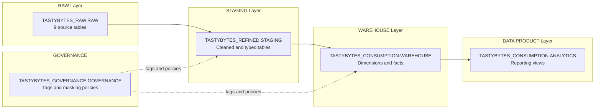
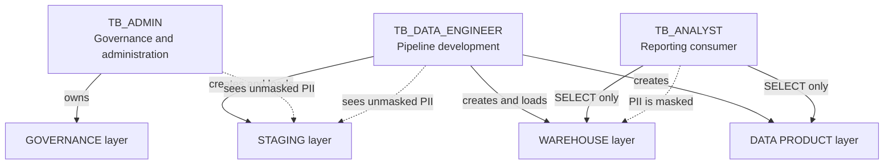
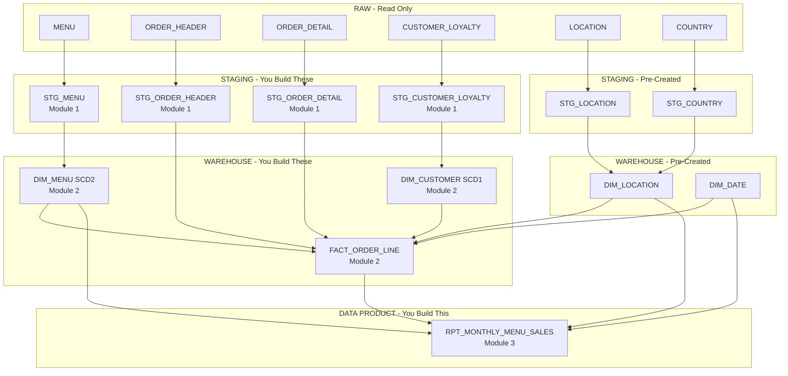

# TastyBytes Data Engineering Exercise — Background

## Purpose and Objectives

This hands-on exercise walks you through building a complete data pipeline in Snowflake. Starting from raw source data, you will create staging tables, a dimensional model, and a reporting view — using only Snowflake-native features.

By the end of this exercise you will have practical experience with:

- **DDL design** — creating tables with appropriate data types, handling data quality issues in source data
- **Semi-structured data** — flattening JSON (VARIANT) columns into relational columns
- **SQL stored procedures** — writing reusable load procedures using TRUNCATE-reload and MERGE patterns
- **Task graphs** — orchestrating pipeline execution with Snowflake Tasks and dependencies
- **Data governance** — applying enterprise tags, column-level masking policies, and catalog documentation (COMMENTs)
- **RBAC** — granting role-based access to the objects you create
- **Dimensional modelling** — building SCD Type 1 and Type 2 dimensions and a fact table
- **Reporting views** — creating a data product that answers a specific business question

---

## Business Scenario

**TastyBytes** is a food truck company operating across multiple cities worldwide. The fleet serves a variety of cuisines — BBQ, tacos, ice cream, and more — through branded food trucks.

The analytics team has requested a monthly dashboard to help them understand:

> **Monthly sales volume, revenue, and margin of menu items and menu item categories, broken down by location and time period.**

To deliver this, you need to build a pipeline that transforms raw transactional data into a clean, well-modelled reporting layer.

### Key Business Definitions

| Term | Definition |
|------|-----------|
| **Sales Volume** | Total quantity of items sold (sum of line-item quantities) |
| **Revenue** | Sum of line-item prices from order details |
| **COGS** | Cost of Goods Sold — sourced from the menu item's `COST_OF_GOODS_USD` multiplied by quantity sold |
| **Margin** | Revenue minus COGS, calculated at the individual order line item level then aggregated |
| **Margin %** | (Margin / Revenue) x 100 |

---

## Architecture Overview

The data platform uses a layered architecture in Snowflake. Each layer has a dedicated database and schema.

### Data Flow

### Layer Descriptions

| Layer | Database.Schema | Purpose |
|-------|----------------|---------|
| **RAW** | `TASTYBYTES_RAW.RAW` | Source tables loaded from operational systems. Read-only — you will not modify these. |
| **STAGING** | `TASTYBYTES_REFINED.STAGING` | Cleaned, correctly typed versions of RAW tables. Data quality issues are fixed here. Governance tags and masking policies are applied. |
| **WAREHOUSE** | `TASTYBYTES_CONSUMPTION.WAREHOUSE` | Dimensional model with dimension tables (SCD Type 1 and 2) and fact tables. Surrogate keys link dimensions to facts. |
| **DATA PRODUCT** | `TASTYBYTES_CONSUMPTION.ANALYTICS` | Reporting views built on top of the warehouse layer, designed for dashboard consumption. |
| **GOVERNANCE** | `TASTYBYTES_GOVERNANCE.GOVERNANCE` | Central location for enterprise tags and masking policies. These are pre-created — you will apply them, not create them. |

### RBAC Model

Three roles control access across the platform:

| Role | Purpose | PII Access |
|------|---------|-----------|
| **TB_ADMIN** | Owns governance objects (tags, policies). Manages access. | Unmasked |
| **TB_DATA_ENGINEER** | Builds and runs pipelines. Creates tables, procedures, and tasks. | Unmasked |
| **TB_ANALYST** | Consumes reporting views and warehouse tables via SELECT. | **Masked** |

---

## What You Will Build

The exercise is split into three modules. Some objects are pre-created for you (shown in grey below); you will build the rest.

### Pipeline Object Map

### Module Summary

| Module | What You Build | Key Skills |
|--------|---------------|------------|
| **Module 1: RAW to STAGING** | 4 staging tables, 4 load procedures, 1 task graph | DDL, type casting, JSON flattening, governance tags, masking, stored procedures, task orchestration |
| **Module 2: STAGING to WAREHOUSE** | 2 dimension tables, 1 fact table, 3 MERGE procedures, 1 task graph | SCD Type 1 and 2, surrogate keys, MERGE statements, fact table loading |
| **Module 3: WAREHOUSE to DATA PRODUCT** | 1 reporting view | Aggregation, multi-table joins, business metric calculations |

### Pre-Created Objects (Available from Setup)

These objects are already created and populated. You can query them and reference their DDL as examples:

| Object | Layer | Description |
|--------|-------|-------------|
| STG_LOCATION | STAGING | Cleaned location data from RAW.LOCATION |
| STG_COUNTRY | STAGING | Cleaned country data from RAW.COUNTRY |
| DIM_LOCATION | WAREHOUSE | Location dimension combining city and country attributes |
| DIM_DATE | WAREHOUSE | Standard date dimension (2019–2025) with year, quarter, month, week, day attributes |
